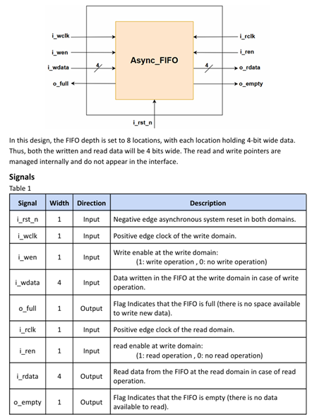
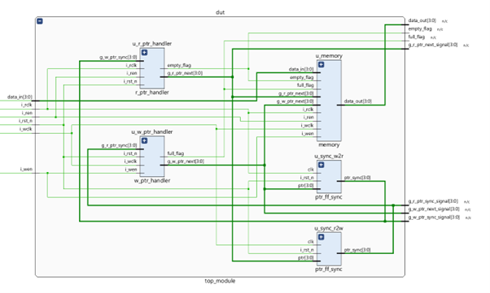
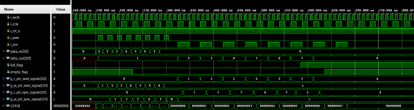

Note:   
This asynchronous FIFO was created for one of the assignments for an FPGA workshop I joined before.   
The project was later refined and uploaded to GitHub for demonstration purposes.   
It is a self-learning project. Definitely not a perfect industry-standard, but I gained significant experience specially regarding CDC while developing it.

  
Figure 1: Requirements of the Assignment  

Figure 2: Block Diagrams of My Outcome

This async FIFO consists of 4 types of modules.   
1.	memory stores and outputs the data with a width of 4 bits and a depth of 3 bits.  
2.	r_ptr_handler processes the reading pointer and empty flag  
3.	w_ptr_handler processes the writing pointer and full flag  
4.	ptr_ff_sync delay the synchronized pointer from either r_ptr_handler to w_ptr_handler or vice versa for 2 cycles for better cross-domain stability.

Several features are included for better stability considering the transition delay in real life even though only behavioural simulations were required in this assignment.
1.	The r_ptr_handler only outputs the corresponding g_r_ptr_next after the writer finished writing at that address, as shown by Figure 4.  

Figure 3: Testbench waveform for r_ptr_handler
2.	The cross-domain transmission are performed in gray code instead of binary to increase its robustness.
3.	1 extra MSB is added to the r_ptr and w_ptr to differentiate full_flag and empty_flag with the following code:
    assign empty_flag_wire = (g_r_ptr_next_wire == g_w_ptr_sync);
    assign full_flag_wire = ((g_w_ptr_next_wire[2:0] == g_r_ptr_sync[2:0]) & (~g_w_ptr_next_wire[3] == g_r_ptr_sync[3]));

    However, for better robustness, the lines are slightly modified by me:
    assign empty_flag_wire = (g_r_ptr_next_wire == g_w_ptr_sync) | (g_r_ptr_next == g_w_ptr_sync);
    assign full_flag_wire = ((g_w_ptr_next_wire[2:0] == g_r_ptr_sync[2:0]) & (~g_w_ptr_next_wire[3] == g_r_ptr_sync[3])) | ((g_w_ptr_next[2:0] == g_r_ptr_sync[2:0]) & (~g_w_ptr_next[3] == g_r_ptr_sync[3]));

Figure 4: Testbench waveform for the top module  
The FIFO successfully received the data_in and outputs data_out in their respective clock domain.

